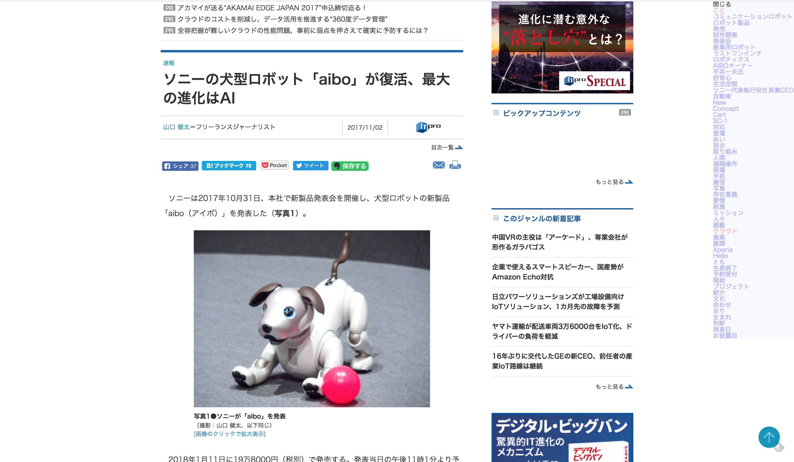

# wordlib

気になる記事の専門用語を知りたいために使えるキーワード抽出機能

Google Chrome拡張機能として使い、抽出したキーワードとその単語の辞書ページのリンクを提示し、

キーワードの意味を調べることができる。



# Require

- node.js
- npm
- Google Chrome

# Build

使用の際はMicrosoft Azure Text Analytics APIのAPIキーが必要

取得後、 `src/api/env.js` というファイルを作成し、以下のようなスクリプトを書くこと

```js
export const AZURE_KEY = 'your own key'
```

編集後以下でビルド

```js
npm install
npm run build
```

# Usage

ビルド後に、Google Chromeで `chrome://extensions/` より拡張機能の管理を開き、

`パッケージ化されていない拡張機能を読み込む` を選択し、このディレクトリを選択することで使用できる。

拡張機能適用後、気になる記事へ移動し、右上に出る `解析` ボタンを選択すると、APIを使いキーワード抽出を行う。
